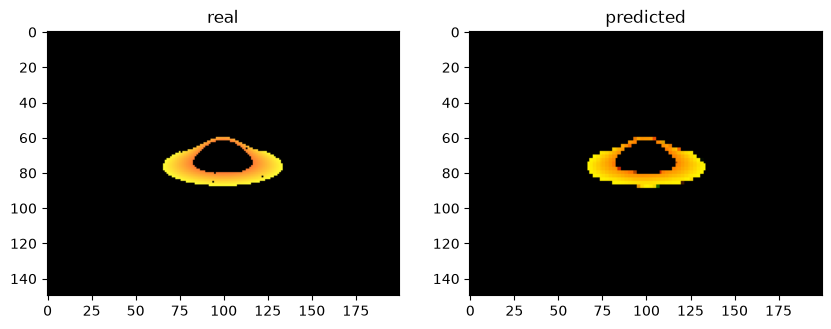

# Black Hole Neural Renderer

A PyTorch-based neural renderer that generates black hole images directly from astrophysical simulation parameters. The model is trained on images produced by a physics-based ray tracer, enabling **real-time visualization** without performing computationally expensive ray tracing during inference.

> **Dataset:** Generated using a modified version of the ray tracer by https://github.com/kavan010/black_hole

---

## Ground Truth vs Prediction

The network learns to approximate the output of the original ray tracer from seven physical input parameters.

<p align="center">
  
</p>

---

## Features

- Trained a neural network to map **7 astrophysical parameters → RGB black hole image**
- Built an **interactive simulator** for exploring the effect of physical parameters in real time
- Eliminates expensive ray tracing at inference by using a learned surrogate model
- GPU acceleration through **PyTorch** with automatic CPU fallback
- Supports live adjustment of:
  - Black hole mass
  - Camera azimuth
  - Camera elevation
  - Accretion disk inner radius
  - Accretion disk outer radius

---

## Model

### Input Parameters

| Parameter | Description |
|-----------|-------------|
| Black Hole Mass | Mass of the black hole |
| Schwarzschild Radius | Event horizon radius |
| Camera Azimuth | Horizontal viewing angle |
| Camera Elevation | Vertical viewing angle |
| Camera Distance | Distance from the black hole |
| Disk Inner Radius | Inner radius of the accretion disk |
| Disk Outer Radius | Outer radius of the accretion disk |

### Network Architecture

```
Physical Parameters (7)
          │
          ▼
Fully Connected Encoder
          │
          ▼
Latent Feature Representation
          │
          ▼
Transposed Convolution Decoder
          │
          ▼
150 × 200 RGB Image
```

**Framework:** PyTorch

**Optimizer:** Adam

**Loss Function:** L1 Loss

---

## Interactive Simulator (this was made using claude)

The trained model is deployed in an interactive simulator built with **Matplotlib**, allowing users to modify simulation parameters and instantly observe the predicted black hole image.

The simulator includes:

- Real-time parameter sliders
- Continuous camera rotation
- Live neural inference
- GPU acceleration (CUDA when available)

---


## Acknowledgements

The training dataset was generated using a modified version of the open-source black hole ray tracer by **kavan010**:

https://github.com/kavan010/black_hole

---

## Disclaimer

This project is a **learned approximation** of a black hole ray tracer. It is intended for rapid visualization and machine learning experimentation rather than physically accurate scientific simulation.
